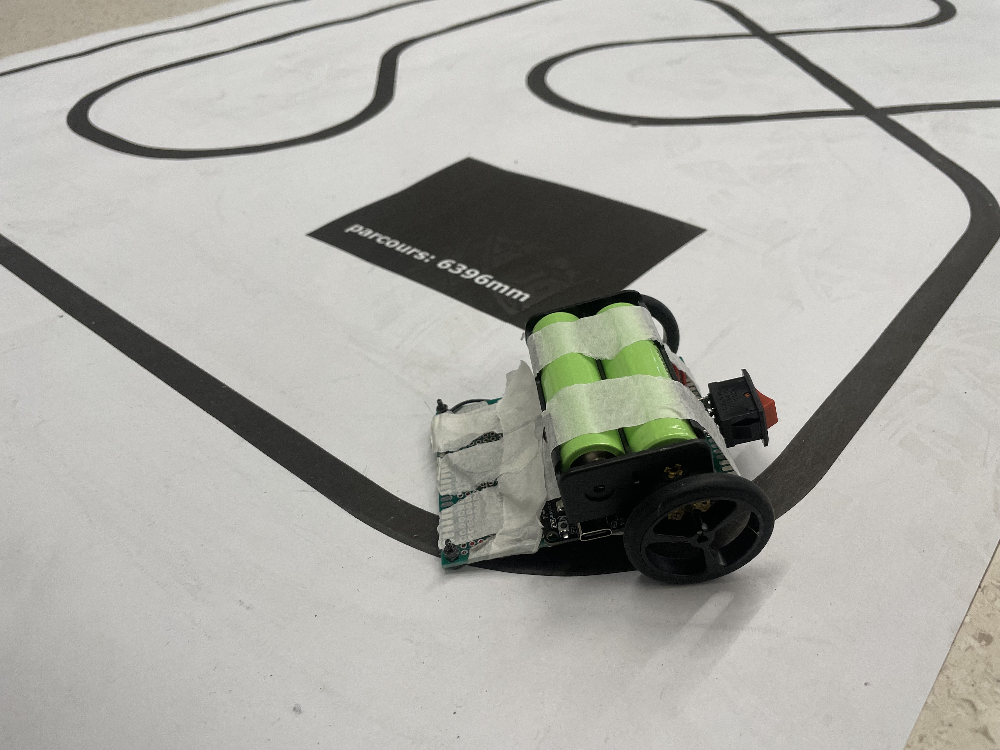

# LineFollower

lege repository die je als template kan gebruiken om een eigen repository te starten voor uw linefollower project

  
## specifications

microcontroller: ESP32D DevKit v1

motors: DC 6V N20 Mini Micro Metal Gear Motor Met Gearwheel

h-bridge: TB6612FNG

sensors: HY-S301

batteries:

wireless communication:

distance sensor - motors:

weight:

speed: 

